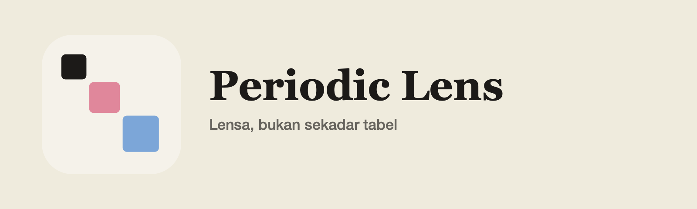
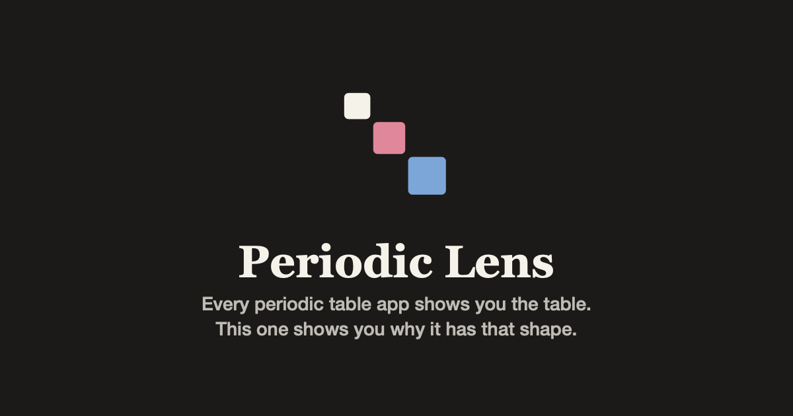

<div align="center">

<picture>
  <source media="(prefers-color-scheme: dark)" srcset=".github/brand/lockup-dark.png">
  <source media="(prefers-color-scheme: light)" srcset=".github/brand/lockup-light.png">
  
</picture>

### Every periodic table app shows you the table.<br>This one shows you why it has that shape — and who digs the elements out of the ground.

[**Open the app →**](https://andifathulms.github.io/periodic-lens/)&nbsp;&nbsp;·&nbsp;&nbsp;[The build](https://andifathulms.github.io/periodic-lens/en/build/)&nbsp;&nbsp;·&nbsp;&nbsp;[Indonesia](https://andifathulms.github.io/periodic-lens/en/indonesia/)&nbsp;&nbsp;·&nbsp;&nbsp;[Method](https://andifathulms.github.io/periodic-lens/en/method/)

[](https://github.com/andifathulms/periodic-lens/actions/workflows/deploy.yml)


</div>

---

An interactive periodic table built around two things that are hard to find elsewhere: an animation explaining where the shape comes from, and a lens showing Indonesia's share of world production per element. Static site, no backend, no runtime network.

English primary, Indonesian secondary. Element names, symbols and chemical terms stay in their standard international form in both locales.

## The two reasons it exists

### The shape

The table's outline **is** the electron configuration. Electrons fill subshells in order of `n + ℓ`, lowest first, ties broken by lower `n` — and because `s` holds 2, `p` holds 6, `d` holds 10 and `f` holds 14, the blocks are 2, 6, 10 and 14 columns wide. That is the whole shape.

The [build page](https://andifathulms.github.io/periodic-lens/en/build/) states the rule, works the sums out on screen, traces three elements end to end before you touch anything, and then shows the twenty elements where the rule's prediction disagrees with the published value — both strings side by side, the rule's answer struck through.

It also lets you **change the rule**. Switch the filling order to strict shell order and the row lengths become `2, 8, 18, 32, 32, 26` instead of `2, 8, 8, 18, 18, 32, 32`. The difference between those two lists is the entire reason the rule matters.

### The Indonesian layer

Nickel, tin, cobalt, bauxite, copper, gold, silver — share of world mine production, every figure carrying its USGS edition year and reporting stage. The lens shows production share and stops there.

## Three principles it will not bend on

**Unknown is not zero.** Many properties simply are not known for the superheavy elements. A missing value is a diagonal hatch — never a colour, never a position on a scale, never an empty cell that reads as small. It is one definition in `lib/elements/unknown.ts`, asserted per lens.

**One lens at a time.** 118 cells carrying several encodings at once is unreadable noise. Colour is a channel that gets swapped, never decoration that accumulates. If a feature needs two encodings, it needs two views.

**Configurations are published values.** The aufbau rule drives the animation and the exception test. It never supplies a configuration for display — including for the twenty elements where it would be wrong.

## The three views

The **grid** colours 118 cells by the active lens. **Topography** renders the same lens as height as well as colour, so periodicity reads as waves across the periods — offered only for continuous lenses, because height cannot order categories without inventing a ranking. **Timeline** puts the same elements on one axis by year of discovery; the metals of antiquity are held off the axis in their own group rather than dated to whichever recorded year happens to be earliest.

One view at a time, for the same reason one lens at a time.

## Running it

```bash
pnpm install
pnpm dev
```

| | |
|---|---|
| `pnpm build` | static export; runs `data:validate` first and writes `.nojekyll` |
| `pnpm preview` | serve `./out` under the production `basePath` |
| `pnpm test:run` | all four suites once |
| `pnpm test:config` | all 118 configurations against published values |
| `pnpm test:aufbau` | rule predictions against the documented exception list |
| `pnpm test:structure` | period lengths, block widths, layout completeness |
| `pnpm test:lens` | unknown handling, ramp monotonicity, contrast |
| `pnpm data:build` | merge datasets, mark unknowns, emit the table and scales |
| `pnpm data:validate` | licences, citations, USGS edition, completeness |

All four suites and `data:validate` gate the build and CI.

## How it is put together

`lib/elements` is pure and runs in Node. `aufbau.ts` implements the filling rule; `unknown.ts` is the single definition of a missing value; `lens.ts` turns a value into a scale position; `layout.ts` turns an atomic number into a position — the standard table, Janet's left-step and a Benfey-style spiral are three position maps over the same 118 records.

A property value is:

```ts
{ type: 'known', value, unit, source } | { type: 'unknown' }
```

There is no bare number and no nullable field, which is what makes *unknown rendered as zero* unrepresentable rather than merely forbidden.

## Data

| Dataset | Source |
|---|---|
| Atomic weights | IUPAC, *Atomic weights of the elements 2021* |
| Configurations, ionisation energies | NIST Atomic Spectra Database (US Government work, public domain); CRC Handbook, 104th ed. |
| Physical properties | CRC Handbook, 104th ed.; Slater (1964) for radii |
| Nucleosynthetic origin | Johnson, *Science* **363**, 474 (2019) |
| Production | USGS Mineral Commodity Summaries 2024 (US Government work, public domain) |

Full licence and citation detail is on the [method page](https://andifathulms.github.io/periodic-lens/en/method/).

Emission spectra are not included. The NIST Atomic Spectra Database would licence cleanly, but per-element line data is a substantially larger dataset than anything here and has not been sourced or verified.

## What it does not do

No molecule builder, reaction predictor or equation balancer. No safety, handling, exposure or first-aid guidance — hazard classification may appear as a cited fact, but guidance is a regulated domain and this is not that tool. No commentary on Indonesian mining policy, downstream processing or environmental impact, in either direction.

For a more comprehensive general reference — isotopes, compounds, spectra, orbital viewers — [ptable.com](https://ptable.com) is excellent, free and mature. This project is not trying to replace it. It exists for the two things ptable does not do.

## Brand

The mark is **Tangga** — three blocks in a growing staircase, the table's own silhouette. Ink is the base step; rose and blue are the two most vivid category swatches from the app's own legend, and keep that assignment.



Masters and every derived size live in `exports/`, which is not tracked. The handful the site serves are in `public/`.

## Deployment

Live at **https://andifathulms.github.io/periodic-lens/**

`main` builds and deploys to GitHub Pages via Actions. `basePath` must match the repository name; `.nojekyll` is written into `out/` by the build. Verify with `pnpm preview` before pushing.
